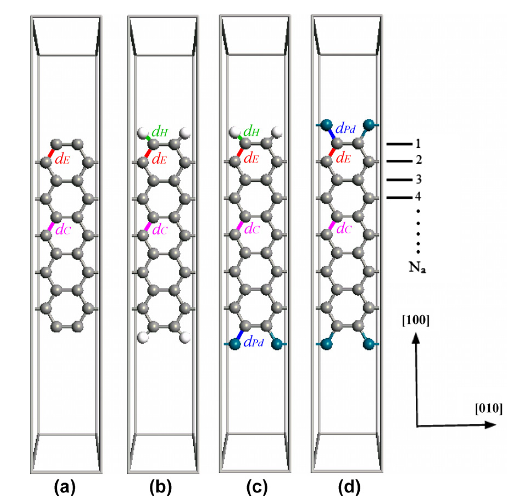

## graphenePD - Investigation of the effects of transition metal palladium on electronical, structural and optical properties of graphene nanoribbons
### Project Information
* Date: May 2012 - Apr 2013
* Funded by: Project Supported by Higher Education Institution (Gazi Univ)
* Number: 05/2012-14
* Budget: 14 955 Turkish liras

### Project Description

**Abstract**

In this study,  the effects of Pd-terminations and Pd-dopings on electronic, structural and optical properties of (5,5), (7,7), (9,9) and (11,11) type armchair graphene nanoribbons will be investigated using ab-initio approach.

### Objectives

Experimental growth of graphene started with the simple removal method (in small pieces) proposed by Novoselov et al., then the device fabrication was one step closer with successful (on a whole substrate but thick) graphene growth by sublimating Si from the SiC surface. In recent days, it has been observed that both large and thin graphene layers can be grown in magnifications on transition metals such as Nickel (Ni), Copper (Cu) and Ruthenium (Ru), contrary to these two methods. Of these, Ru has been an interesting success and attention has turned to other similar transition metals. Palladium (Pd), on the other hand, draws attention to its possible interaction with graphene because it is relatively easy to obtain, high purity and similar physical properties compared to Ru.

In this study, we intend to examine how the Pd element affects the electronic and optical properties of graphene by using ab-initio computational methods for edge saturation and doping in graphene nanostrip structures.

### Project Consortium

#### Project Team
* Assoc. Prof. Dr. Sefer Bora Lisesivdin (PI) (Gazi Univ.)
* Dr. Beyza Lisesivdin (Gazi Univ.)
* Abdullah Fatih Kuloglu
* Cem Gunes

#### Other Colleagues, Students and Collaborations
* Prof. Dr. Ekmel OZBAY (Bilkent Univ.)

### Project Structure
n/a

### Project News*

#### February 2016
* New book chapter from our project:	S. B. Lisesivdin, B. Sarikavak-Lisesivdin, E. Ozbay “Chapter 18: The effects of Doping and Termination with transition metals on electronic properties of Graphene Nanosheets and Nanoribbons” Graphene Science Handbook: Electrical and Optical Properties Vol. 3 (2014).

#### April 2013
* Project is finished

#### February 2013
* New article from our project: F. Kuloglu, B. Sarikavak-Lisesivdin, S. B. Lisesivdin, E. Ozbay "First-principles calculations of Pd-terminated symmetrical armchair graphene nanoribbons" Comp. Mater. Sci.68, 18 (2013).

#### December 2012
* New thesis from our project: Abdullah Fatih Kuloğlu “Kenarları Paladyum İle Sonlandırılmış Grafen Nanoşeritlerin Elektronik Özelliklerinin İncelenmesi” MSc Thesis, Institute of Science, Gazi University, 2012.

#### May 2012
* New proceeding from our project: A. F. Kuloglu, B. Alsancak, C. Gunes, S. B. Lisesivdin, E. Ozbay “Kenarlari Paladyum Atomlari ile Sonlandirilmis Farkli Genisliklerdeki Armchair Grafen Nanoseritlerin Elektronik Ozelliklerinin Yogunluk Fonksiyonu Teorisi Kullanilarak Incelenmesi” I. Solid State Matter Physics İzmir Meeting, p01 (2012).
* Project is started.

*: Project site is prepared after project was finished.
